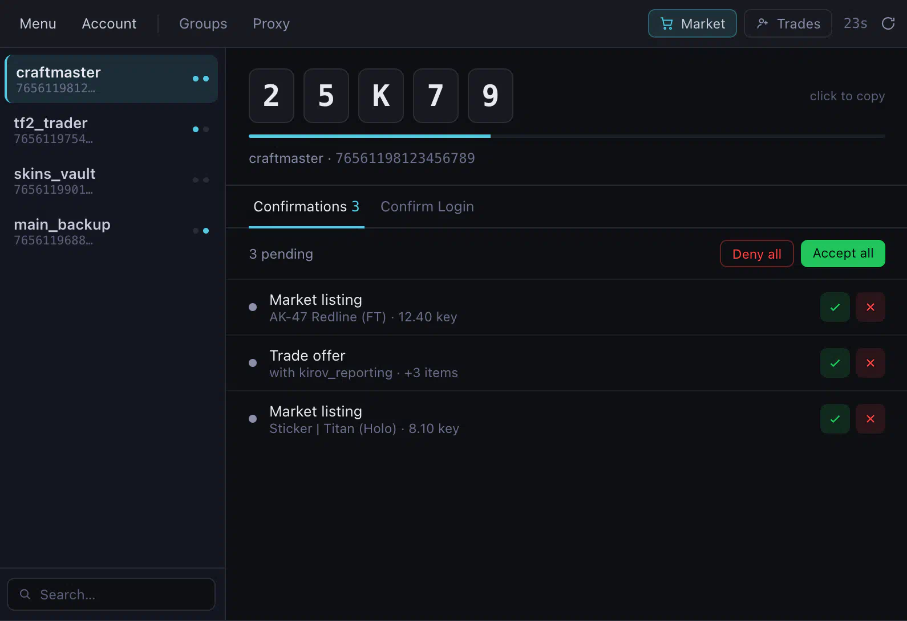

# StewardAuth

**Русский** · [English](README.md) · [中文](README.zh.md)

[](https://github.com/shinyawave/stewardauth/releases/latest)
[](https://github.com/shinyawave/stewardauth/releases)

[](https://tauri.app)
[](LICENSE)
[](https://github.com/shinyawave/stewardauth/stargazers)
[](https://t.me/StewardAuth)



Нативный **Steam Desktop Authenticator для macOS** на Apple Silicon — живые коды Steam Guard, подтверждения обменов и торговой площадки, управление несколькими аккаунтами. Быстрое приложение в меню-баре и Dock.

[**⚡ Быстрая установка**](#быстрая-установка-homebrew) · [**📦 Простая установка**](#простая-установка-dmg) · [**💬 Telegram**](https://t.me/StewardAuth)

> **Требования:** macOS 12 (Monterey) или новее · Apple Silicon (M1–M5)

## Возможности

- **Живые коды Steam Guard** — отсчёт 30 секунд, копирование по клику.
- **Подтверждения обменов и маркета** — принять/отклонить, с опциональным фоновым **авто-подтверждением** для каждого аккаунта.
- **Несколько аккаунтов** — поиск в сайдбаре, группы, действия по правому клику.
- **Создание нового аутентификатора** с нуля (вход → код по SMS/e-mail → `.maFile` + код восстановления).
- **Импорт** готовых `.maFile`, ZIP-архивов или папок SDA — перетаскиванием.
- **Прокси на каждый аккаунт** (HTTP / HTTPS / SOCKS5).
- **Опциональное шифрование** хранилища мастер-паролем (Argon2id + AES-256-GCM).
- **8 языков интерфейса** и встроенный **авто-апдейтер**.

## Быстрая установка (Homebrew)

Ещё нет Homebrew? Сначала установите его:

```bash
/bin/bash -c "$(curl -fsSL https://raw.githubusercontent.com/Homebrew/install/HEAD/install.sh)"
```

Затем установите StewardAuth:

```bash
brew tap shinyawave/tap
brew install --cask stewardauth
```

Если Homebrew (6.0+) попросит доверие к tap, выполните один раз: `brew trust shinyawave/tap`.

> **Первый запуск:** StewardAuth подписан ad-hoc и не нотаризован, поэтому macOS Gatekeeper блокирует первый запуск. Выполните один раз:
> ```bash
> xattr -cr "/Applications/StewardAuth.app"
> ```
> …либо правый клик по **StewardAuth** в Applications → **Открыть** → **Всё равно открыть**. Дальнейшие авто-обновления ставятся без этого шага.

## Простая установка (.dmg)

Терминал не нужен:

1. Скачайте `StewardAuth_0.1.0_aarch64.dmg` со страницы [**Releases**](https://github.com/shinyawave/stewardauth/releases).
2. Откройте `.dmg` и перетащите **StewardAuth** в **Applications**.
3. Первый запуск: **правый клик** по StewardAuth → **Открыть** → **Всё равно открыть** (разовый шаг Gatekeeper; или выполните `xattr -cr "/Applications/StewardAuth.app"`).

## Где хранятся ваши аккаунты

По умолчанию аккаунты сохраняются как файлы `.maFile` в папке:

```
~/Library/Application Support/com.stewardauth.app/maFiles/
```

Эту папку можно **открыть или перенести** в любое место (внешний диск, синхронизируемая папка и т.д.) через **Настройки → maFiles / Каталог данных** в приложении. Опциональный **мастер-пароль** шифрует манифест хранилища — список аккаунтов и настройки — через Argon2id + AES-256-GCM; сами `.maFile` хранятся по классической модели Windows SDA (открытые файлы на диске), поэтому держите эту папку в приватном месте и делайте резервные копии.

## Сообщество

Вопросы, обновления, обратная связь → **[Telegram: @StewardAuth](https://t.me/StewardAuth)**

## Отказ от ответственности

StewardAuth — независимый общественный проект. Не связан с Valve или Steam и не одобрен ими.

## Лицензия

[AGPL-3.0-or-later](LICENSE).
